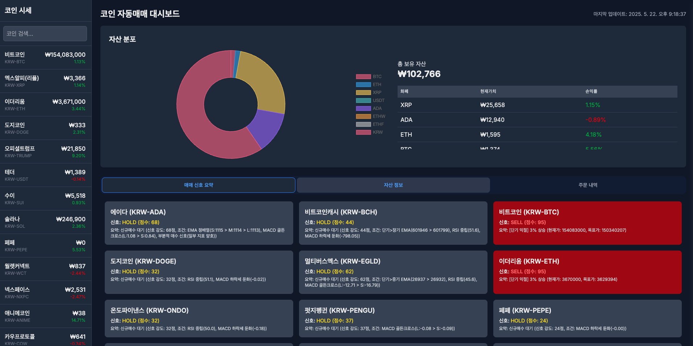

# Coinbot Client

A web-based client application for cryptocurrency information and trading.



## Introduction

Coinbot Client is a Next.js-based dashboard application for visualizing and managing cryptocurrency trading data. It provides comprehensive features for tracking cryptocurrency prices, viewing asset information, and monitoring trade history.

## Key Features

- Real-time cryptocurrency price tracking with detailed charts
- Comprehensive asset portfolio visualization
- Detailed order and trade history management
- Interactive dashboard with customizable views
- Dark and light theme support via next-themes

## Technology Stack

- [Next.js](https://nextjs.org) 15.3.2
- [React](https://react.dev) 19.0.0
- [TypeScript](https://www.typescriptlang.org) 5.x
- [Tailwind CSS](https://tailwindcss.com) 4.x
- [ApexCharts](https://apexcharts.com) 4.7.0
- [Chart.js](https://www.chartjs.org) 4.4.9
- [Headless UI](https://headlessui.com) 2.2.2
- [next-themes](https://github.com/pacocoursey/next-themes) 0.4.6

## Installation

```bash
# Clone repository
git clone <repository-url>
cd coinbot-client

# Install dependencies
pnpm install
```

## Development

```bash
# Run development server (with Turbopack)
pnpm dev

# Alternative package managers
npm run dev
yarn dev
bun dev
```

The application will be available at http://localhost:3000.

## Project Structure

```
coinbot-client/
├── src/
│   ├── app/               # Pages and routing
│   ├── components/        # UI components
│   │   ├── ui/            # Base UI components
│   │   └── ...            # Feature components
│   ├── lib/               # Utilities and helper functions
│   └── types.ts           # Type definitions
├── public/                # Static files
└── ...                    # Configuration files
```

## Application Components

The application includes several key components:

- **Dashboard**: Main overview of cryptocurrency markets and your portfolio
- **CoinPrices**: Real-time price tracking for multiple cryptocurrencies
- **AssetChart**: Interactive charts for visualizing price movements
- **DetailedAssetInfo**: Comprehensive information about specific assets
- **TradeHistory**: Complete record of trading activities
- **DetailedOrders**: Management of open and completed orders

## Building for Production

```bash
# Create production build
pnpm build

# Run production server
pnpm start
```

## Learn More

- [Next.js Documentation](https://nextjs.org/docs) - Learn about Next.js features and API.
- [React Documentation](https://react.dev) - Learn about React.
- [Tailwind CSS Documentation](https://tailwindcss.com/docs) - Learn about Tailwind CSS.
